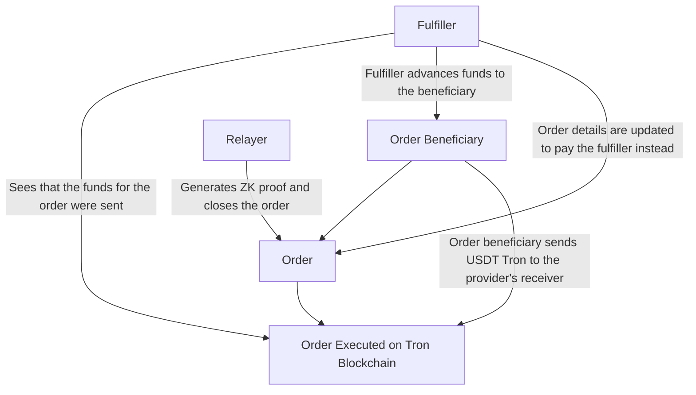
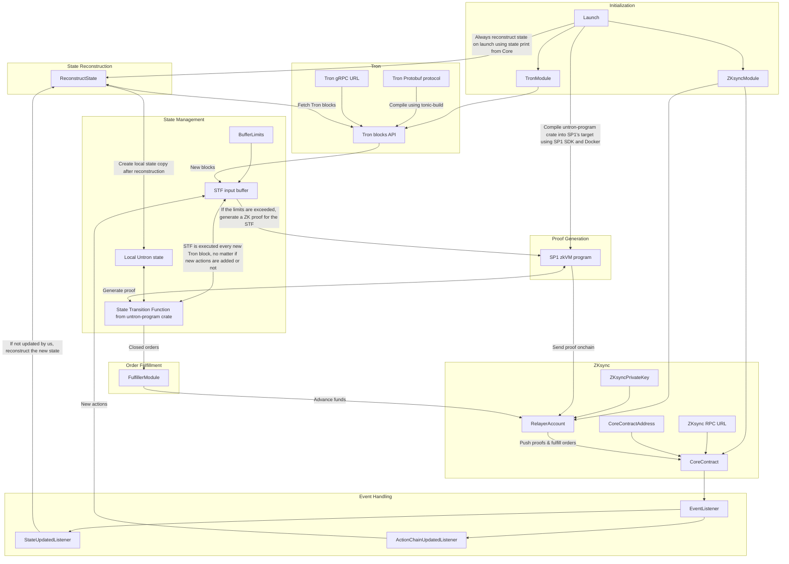
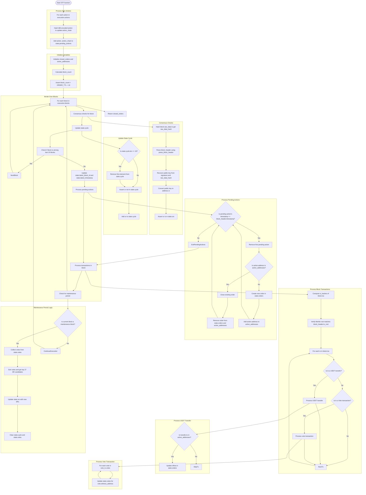
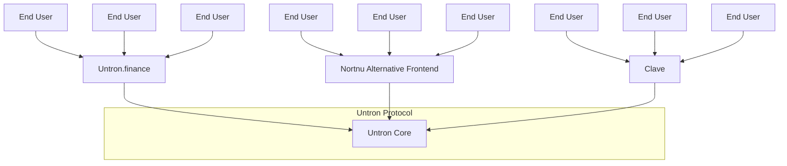

# How Untron works

Although seeming not obvious at all, we decided to start this deep dive into Untron protocol from its relayer software. Why? Well, Untron's relayer is, in fact, the thing that runs Untron. It's connected to all critical components of the protocol and orchestrates its operation. Therefore, we can start by explaining how the Relayer connects things you don't yet understand, and then move on to explaining those things.

Firstly, let's outline three main rules Untron relayer was built according to:

- Relayer is a starter. Therefore, all it must do is to start things that are already working properly when started;
- From this it follows that the Relayer must not be the source of trust—the worst thing it could do to the protocol is to go down and cause a liveness failure;
- To minimize the risk of and the damage from a potential liveness failure, the Relayer must be permissionless and relatively simple to run.

Simplifying, all the Relayer does is generating ZK proofs of the state transition function of Untron Protocol and sending them to the Core contract. This task is permissionless, and anyone can run the relayer, provided they can afford the cost of ZK proof generation.

### Relayers and Fulfillers

Besides relaying, relayer-the-crate implements a _Fulfiller_. Fulfillers advance funds for orders that were already executed (sent USDT Tron for), but this fact was not yet ZK proven onchain. If some order was _fulfilled_, it means that its beneficiary (could be order creator, but not necessarily; see later) has already received its ask on the destination chain after sending USDT Tron, but the Core contract doesn't yet know they did send it. This is because one of the Fulfillers had sent the ask in advance, after seeing that the transfer did indeed happen on Tron blockchain.

Fulfillers carry the risk of Tron blockchain's reorgs and wait for the ZK proof to get their funds back, in exchange for a small fee. Similarly to relaying tasks, fulfillers are not the source of trust, and the worst that can happen if there are no fulfillers live is that the users will receive their funds in about 30 minutes rather than a few seconds. Considering the Tron blockchain has never reorged in its entire history, this risk is negligible.



## Relayer Software's Logic



Now, let's break it down step by step.

### Initialization

The relayer is initialized with a configuration file (`config.toml`), which contains the following parameters:

- `ethereum.rpc_url`: The URL of the ZKsync Era RPC node.
- `ethereum.private_key`: The private key of the relayer account on ZKsync Era network.
- `ethereum.core_address`: The address of the Untron Core contract on ZKsync Era network.
- `tron.rpc_url`: The URL of Tron gRPC node API.
- `buffer.max_blocks`: The maximum number of new Tron blocks to initiate ZK proof generation. 0 if no limit.
- `buffer.max_actions`: The maximum number of new Untron actions to initiate ZK proof generation. 0 if no limit.
- `buffer.min_interval`: The minimum interval between two consecutive ZK proof generations in seconds. 0 if no interval.

### Build.rs

Before initializing all modules, the Relayer initiates an SP1 zkVM prover instance. It generates Groth16 ZK proofs of State Transition Function (STF) and sends them to the Core contract from the relayer's account. To initiate the prover, the Relayer compiles [untron-program](https://github.com/ultrasoundlabs/untron/tree/main/program) into SP1 zkVM target binary in Docker mode to ensure the ZK program is always the same given the same source code.

```rust
use sp1_build::{build_program_with_args, BuildArgs};
// Protobuf-related imports

fn main() -> Result<(), Box<dyn std::error::Error>> {
    // Protobuf compilation logic above

    println!("Building ZK program, make sure Docker is running...");

    let args = BuildArgs {
        docker: true,
        output_directory: "./elf".to_string(),
        ..Default::default()
    };
    build_program_with_args("../program", args);
    Ok(())
}
```

_(from [build.rs](https://github.com/ultrasoundlabs/untron/tree/main/relayer/build.rs))_

This compilation of untron-program should not be confused with constant calling of the State Transition Function from it. Besides compiling the program as an executable, the Relayer imports its STF as a dependency crate, getting rid of the overhead from initializing SP1 environment every Tron block.

```rust
tracing::info!("Executing state transition function...");

let _ = untron_program::stf(
    &mut state,
    Execution {
        actions: self.get_latest_actions().await?,
        blocks,
    },
);

tracing::info!("State transition function executed");
let state_hash = hash(&bincode::serialize(&state).unwrap());
tracing::info!("State hash: {:?}", hex::encode(state_hash));

let contract_state_hash = self.contract.state_hash().call().await?;
if state_hash != contract_state_hash {
    panic!(
        "State hash mismatch: {} != {}. This might be the case of Core's misconfiguration or a bug in the relayer. If you think it's the latter, please report it to the developers.",
        hex::encode(state_hash),
        hex::encode(contract_state_hash)
    );
}
```

_(from [main.rs](https://github.com/ultrasoundlabs/untron/tree/main/relayer/src/main.rs))_

Configuration values under `tron` are used to initiate **TronModule**. Besides the gRPC URL in it, **TronModule** requires compiled Tron Protobuf files to decode Tron transactions. They're compiled in [build.rs](https://github.com/ultrasoundlabs/untron/tree/main/relayer/build.rs) using [tonic-build](https://docs.rs/tonic-build/latest/tonic_build/) crate. Untron's repository [includes Tron Protocol as a git submodule](https://github.com/ultrasoundlabs/untron/tree/main/lib/java-tron/protocol/src/main/protos/), so it's necessary to initialize all submodules before building the Relayer.

```rust
// ZK-related imports
use std::fs;
use std::io;
use std::path::Path;

fn copy_dir_all(src: impl AsRef<Path>, dst: impl AsRef<Path>) -> io::Result<()> {
    fs::create_dir_all(&dst)?;
    for entry in fs::read_dir(src)? {
        let entry = entry?;
        let ty = entry.file_type()?;
        if ty.is_dir() {
            copy_dir_all(entry.path(), dst.as_ref().join(entry.file_name()))?;
        } else {
            fs::copy(entry.path(), dst.as_ref().join(entry.file_name()))?;
        }
    }
    Ok(())
}

fn main() -> Result<(), Box<dyn std::error::Error>> {
    println!(
        "Building Tron protocol... If it fails, make sure you initialized submodules in this repo."
    );

    copy_dir_all(
        Path::new("../lib/googleapis/google"),
        Path::new("../lib/java-tron/protocol/src/main/protos/google"),
    )?;
    tonic_build::configure()
        .build_server(false)
        .boxed("BlockExtention")
        .compile(
            &["../lib/java-tron/protocol/src/main/protos/api/api.proto"],
            &["../lib/java-tron/protocol/src/main/protos"],
        )?;
    fs::remove_dir_all("../lib/java-tron/protocol/src/main/protos/google")?;

    // ZK program compilation logic below
}

```

_(from [build.rs](https://github.com/ultrasoundlabs/untron/tree/main/relayer/build.rs))_

## Untron Program (State Transition Function)

The crucial part of Untron Protocol is its [ZK program](https://github.com/ultrasoundlabs/untron/tree/main/program/). It is responsible for reading all contents of Tron blocks and filtering out information relevant to orders in Untron Core.

In some sense, Untron's ZK program is a Rust rewrite of [Tron's node implementation](https://github.com/tronprotocol/java-tron), with light block verification and Untron-specific logic injected into it. Similarly to other node implementations, Untron Program includes its own state, needed to keep track of all orders and blocks in Tron blockchain, and the State Transition Function (STF). STF accepts the old state, a list of new _actions_ and blocks in Tron blockchain, and light-executes these blocks against the new orders to determine which orders were closed (that is, received required amount in USDT TRC20). It then commits to the new state and the list of orders that were closed.

Untron Program was implemented with ZK-friendliness in mind, so it's feasible to utilize Rust-based zkVMs to generate ZK proofs of its STF and easily verify them onchain. In our case, we utilize [SP1 zkVM](https://docs.succinct.xyz), but other zkVMs are possible to integrate as well. Generated ZK proofs are then sent to the Core contract for verification, and the respective orders are closed in the system. This way, we power trustless P2P exchange orders between Tron and other blockchains.



The program contains a large set of logic related to verifying the contents of Tron blocks and maintaining the state of the protocol. But, in short and simplifying, these are the main tasks the program performs:

- Maintaining the list of active Super-Representatives (SRs) who are authorized to propose new blocks;
- Accepting the list of pending actions from the Core contract and processing them respectively to timestamps of the blocks;
- Accepting new Tron blocks, performing the consensus checks for each of them;
- Iterating over all transactions in the block, finding USDT transfers related to the active orders in Core and storing updates (inflow) in the state;
- Closing orders that received enough USDT;
- Every maintenance period (7200 blocks), the program counts all votes for new SRs and updates the list of active SRs.

_A TL;DR of Tron's consensus from [the first version of Untron program](https://github.com/ultrasoundlabs/zktron), called "zktron" at the time:_

```
Tron's consensus mechanism is deadly simple. Every 7200 blocks users delegate their TRX to validators (representatives), and the 27 validators with most votes become Super Representatives - ones who produce blocks. Producer selection is round-robin, and after 18 confirmations (that is, 2/3 of the SR set) the block is considered finalized.

The block production is an ECDSA signature over the SHA256 hash of the protobuf-encoded block header. That is, one block = one signature. This allows us to efficiently generate ZK proofs for light verification of the Tron blockchain. Even though Tron does not merkleize state, transaction root in the block headers is already pretty powerful.
```

It's worth adding that the transaction root is powerful because we can not only recover all transactions from the block in a ZK proof, but also verify if they were successfully executed. This is possible because all transactions in Tron carry their execution status:

```protobuf
message Transaction {
  ...
  message Result {
    enum code {
      SUCESS = 0;
      FAILED = 1;
    }
    enum contractResult {
      DEFAULT = 0;
      SUCCESS = 1;
      REVERT = 2;
      ...
    }
    int64 fee = 1;
    code ret = 2;
    contractResult contractRet = 3;
...
```

_(from [Tron's Protobuf protocol](https://github.com/ultrasoundlabs/untron/tree/main/lib/java-tron/protocol/src/main/protos/core/Tron.proto))_

The internals might seem complicated, but Tron's consensus is actually pretty simple. For more details about how it works internally, you can read [the program's source code](https://github.com/ultrasoundlabs/untron/tree/main/program/src/lib.rs) or [Tron light client in Python](https://github.com/ultrasoundlabs/tron-research/tree/20011157481051903247d4d4fcfdd7f4df77acb1) implemented by Alex Hook, the inventor of Untron Protocol. There's [an official documentation of Tron's consensus](https://developers.tron.network/docs/concensus), but it's not as detailed as the code or this documentation.

### ZK proving STF

Untron Program's crate implements an executable entry point [(main.rs)](https://github.com/ultrasoundlabs/untron/tree/main/program/src/main.rs), which allows the program to be compiled into a RISC-V binary and proved via SP1 zkVM. The entry point provides the STF with the list of blocks and actions from the private inputs of the circuit, and runs the STF, returning (committing to) the list of closed orders and prints of the new Program's state to the Core contract for further processing.

```rust
pub fn main() {
    // read the serialized state from the proof's private inputs
    let serialized_state = read_vec();
    // compute the old state hash
    let old_state_hash = crypto::hash(&serialized_state);
    // deserialize the state using "bincode" serialization scheme
    let mut state: State = bincode::deserialize(&serialized_state).unwrap();

    // read the execution payload from the private inputs
    // INPUT FORMAT:
    // - actions: Vec<u8> (bincode serialized Vec<Order>)
    // - blocks: Vec<u8> (bincode serialized Vec<RawBlock>)
    let execution = Execution {
        actions: bincode::deserialize(&read_vec()).unwrap(),
        blocks: bincode::deserialize(&read_vec()).unwrap(),
    };

    // get the latest zk proven Tron blockchain's block id and Untron's action chain (chained hash of all actions)
    let old_block_id = state.latest_block_id;
    let old_action_chain = state.action_chain;

    // perform execution over the state through the state transition function (see lib.rs for details)
    let closed_orders = stf(&mut state, execution);

    // compute the new state hash
    let new_state_hash = crypto::hash(&bincode::serialize(&state).unwrap());

    let public_values = UntronPublicValues::abi_encode(&(
        old_block_id,
        state.latest_block_id,
        old_action_chain,
        state.action_chain,
        old_state_hash,
        new_state_hash,
        closed_orders,
    ));

    // commit the public values as public inputs for the zk proof
    commit_slice(&public_values);
}
```

_(from [main.rs](https://github.com/ultrasoundlabs/untron/tree/main/program/src/main.rs) with some comments changed. Yes, it's actually this tiny.)_

**_How does it work? What are the private and public inputs?_**

If you're not familiar with the concept of ZK proofs (you really should be, though), you can think of it like this:

- _Public inputs_ are values known by both the prover (relayer) and the verifier (Core contract). In our case, they're the old and new IDs of Tron blocks, the old and new action chain tips (actions in the Core are chained into hash chains), the old and new state hashes, and the list of closed orders.
- _Private inputs_ are values known only to the prover (relayer). In our case, they're the list of blocks and actions from the Tron blockchain and the list of pending actions from the Untron contract. We store them in private because there is no way we could fit ~2 GB of Tron blocks onchain every day. This is one of the beauties of ZK proofs: the contract doesn't even need to have all data if it's sure that the computation done over them was correct.
- _Proof_ is the data that the prover (relayer) provides to the verifier (Core contract) to prove that the public inputs (info about closed orders) are correct.

The prover runs the Untron Program with the private inputs, producing the list of closed orders and the new state of the program. Then, it commits to them and provides the contract with a ZK proof that the list of closed orders and the new state of the program are correct against. The verifier runs the Untron Program on the public inputs and checks the ZK proof. If the proof is correct, the verifier accepts the proof and the list of closed orders and the new state of the program as valid.

## Untron Core in one breath

Now, let's clean up some accumulated confusion about what Untron Core does and how it works.

Untron Core is a smart contract that manages peer-to-peer (P2P) orders between USDT on Tron and its native chain—in our case, ZKsync Era. The orders are P2P because technically people buy and sell USDT for USDT from each other, just on the different chains. To verify the fact of USDT transfer on Tron network, Untron Core utilizes ZK proofs of Untron Program.

### Order Workflow in Untron Core

> **Warning**: This diagram is slightly simplified and must not be used for reimplementation or logic auditing.

```mermaid
flowchart TD
    A[Start: Order Creator Wants to Swap USDT Tron to USDT L2]

    %% Step 1: Order Creator Initiates an Order
    A --> B[Order Creator Calls createOrder]

    %% Step 2: Collect Collateral
    B --> C[Collect requiredCollateral from Order Creator]

    %% Step 3: Validate Receiver Availability
    C --> D{Is Receiver Busy?}

    %% If Receiver is Busy
    D -->|Yes| E{Is Existing Order Expired?}
    E -->|Yes| F[Free the Receiver]
    E -->|No| G[Revert: Receiver is busy]
    G --> H[End]

    %% If Receiver is Not Busy
    D -->|No| I[Proceed to Validate Receiver Ownership]

    %% Step 4: Validate Receiver Ownership
    F --> I
    I --> J{Is Receiver Owned by Provider?}
    J -->|Yes| K[Proceed to Validate Provider's Liquidity]
    J -->|No| L[Revert: Receiver is not owned by provider]
    L --> H

    %% Step 5: Validate Provider's Liquidity
    K --> M{Does Provider Have Sufficient Liquidity?}
    M -->|Yes| N[Proceed to Validate Rate Consistency]
    M -->|No| O[Revert: Provider does not have enough liquidity]
    O --> H

    %% Step 6: Validate Rate Consistency
    N --> P{Does Rate Match Provider's Rate?}
    P -->|Yes| Q[Proceed to Validate Order Size]
    P -->|No| R[Revert: Rate does not match provider's rate]
    R --> H

    %% Step 7: Validate Order Size
    Q --> S{Is Order Size Within Provider's Min and Max Limits?}
    S -->|Yes| T[Deduct Provider's Liquidity]
    S -->|No| U[Revert: Order size is out of bounds]
    U --> H

    %% Step 8: Deduct Provider's Liquidity
    T --> V[Update Provider's Liquidity Balance]

    %% Step 9: Update Action Chain and Order State
    V --> W[Update Action Chain]
    W --> X[Mark Receiver as Busy]
    X --> Y[Store Order Details]
    Y --> Z[Emit OrderCreated Event]

    %% Option to Modify or Stop Order
    Z --> AA{Does Order Creator Want to Modify or Stop Order?}
    AA -->|Yes| AB{Modify or Stop?}
    AB -->|Modify| AC[Call changeOrder]
    AC --> AD{Is Caller the Order Creator and Order Unfulfilled?}
    AD -->|Yes| AE[Update Order Transfer Details]
    AD -->|No| AF[Revert: Only creator can change the order]
    AF --> H

    AB -->|Stop| AG[Call stopOrder]
    AG --> AH{Is Caller the Order Creator and Order Unfulfilled?}
    AH -->|Yes| AI[Proceed to Stop Order]
    AH -->|No| AJ[Revert: Only creator can stop the order]
    AJ --> H

    %% Stopping an Order
    AI --> AK[Update Action Chain to Reflect Stop Action]
    AK --> AL[Refund Provider's Liquidity]
    AL --> AM[Refund Order Creator's Collateral]
    AM --> AN[Delete Order]
    AN --> AO[Emit OrderStopped Event]
    AO --> H

    %% If No Modification or Stopping
    AA -->|No| AP[Order Remains Active Until Fulfillment or Expiry]

    %% Step 10: Fulfiller Advances USDT L2
    AP --> AQ{Does a Fulfiller Decide to Fulfill the Order?}
    AQ -->|Yes| AR[Fulfiller Calls fulfill]
    AR --> AS[Collect Total Amount from Fulfiller]

    %% Step 11: Process Each Receiver's Order
    AS --> AT[For Each Receiver]
    AT --> AU[Retrieve Active Order]
    AU --> AV[Calculate Amount and Fee]
    AV --> AW[Update Expected Total]

    %% Step 12: Validate Fulfillment Amount
    AW --> AX{Is Total Amount >= Expected Total?}
    AX -->|Yes| AY[Proceed with Fulfillment]
    AX -->|No| AZ[Revert: Total does not match]
    AZ --> H

    %% Step 13: Perform Transfer to Order Creator
    AY --> BA[Perform Transfer via smartTransfer]
    BA --> BB[Refund Order Creator's Collateral]
    BB --> BC[Update Action Chain to Free Receiver]
    BC --> BD[Update Order to Reflect Fulfillment]
    BD --> BE[Emit OrderFulfilled Event]
    BE --> BF{Is There Excess Amount?}
    BF -->|Yes| BG[Refund Excess to Fulfiller]
    BG --> BH[Wait for ZK Proof Submission]
    BF -->|No| BH

    %% Step 14: ZK Proof Submission
    BH --> BI[Relayer Calls closeOrders with ZK Proof]
    BI --> BJ[Verify ZK Proof and Public Values]

    %% Step 15: Validate Proof
    BJ --> BK{Is Proof Valid and Public Values Match State?}
    BK -->|Yes| BL[Proceed to Process Closed Orders]
    BK -->|No| BM[Revert: Invalid proof or state mismatch]
    BM --> H

    %% Step 16: Update Global State
    BL --> BN[Update blockId, latestExecutedAction, stateHash]

    %% Step 17: Process Each Closed Order
    BN --> BO[For Each Closed Order]
    BO --> BP[Retrieve Order Details]
    BP --> BQ[Calculate minInflow]
    BQ --> BR[Calculate Amount and Fee]
    BR --> BS[Update Transfer Details]

    %% Step 18: Transfer Funds Based on Fulfillment Status
    BS --> BT{Was Order Fulfilled Earlier?}
    BT -->|Yes| BU[Transfer USDT L2 to Fulfiller]
    BT -->|No| BV[Transfer USDT L2 to Order Creator]

    %% Step 19: Handle Collateral
    BV --> BW{Did Order Creator Send USDT Tron?}
    BW -->|Yes| BX[Refund Collateral to Order Creator]
    BW -->|No| BY[Slash Collateral, Transfer to Contract Owner]
    BU --> BX

    %% Step 20: Release Receiver and Delete Order
    BX --> BZ[Release Receiver if Not Fulfilled]
    BY --> BZ
    BZ --> CA[Delete Order from Storage]
    CA --> CB[Emit OrderClosed Event]

    %% Step 21: Distribute Fees
    CB --> CC[Transfer Accumulated Fees to Owner]

    %% End
    CC --> H[End]
```



Untron Core natively supports swaps between USDT (used as liquidity) and other tokens through 1inch Aggregator, and cross-chain transfers of these tokens through Across Bridge. This way, as long as there's a way to initiate an _untron swap_ on ZKsync Era, users can untron into any token on virtually any chain of the Ethereum ecosystem.

```solidity
/// @notice The order creation function
/// @param provider The address of the liquidity provider owning the Tron receiver address.
/// @param receiver The address of the Tron receiver address
///                that's used to perform a USDT transfer on Tron.
/// @param size The maximum size of the order in USDT L2.
/// @param rate The "USDT L2 per 1 USDT Tron" rate of the order.
/// @param transfer The transfer details.
///                 They'll be used in the fulfill or closeOrders functions to send respective
///                 USDT L2 to the order creator or convert them into whatever the order creator wants to receive
///                 for their USDT Tron.
function createOrder(address provider, address receiver, uint256 size, uint256 rate, Transfer calldata transfer)
    external;
```

_(from [IUntronCore.sol](../contracts/src/interfaces/IUntronCore.sol))_

```solidity
/// @notice Struct representing a transfer.
struct Transfer {
    // recipient of the transfer
    address recipient;
    // destination chain ID of the transfer.
    // if not equal to the contract's chain ID, Across bridge will be used.
    uint256 chainId;
    // Across bridge fee. 0 in case of direct transfer.
    uint256 acrossFee;
    // whether to swap USDT to another token before sending to the recipient.
    bool doSwap;
    // address of the token to swap USDT to.
    address outToken;
    // minimum amount of output tokens to receive per 1 USDT L2.
    uint256 minOutputPerUSDT;
    // whether the minimum amount of output tokens is fixed.
    // if true, the order creator will receive exactly minOutputPerUSDT * amount of output tokens.
    // if false, the order creator will receive at least minOutputPerUSDT * amount of output tokens.
    bool fixedOutput;
    // data for the swap. Not used if doSwap is false.
    bytes swapData;
}
```

_(from [IUntronTransfers.sol](../contracts/src/interfaces/IUntronTransfers.sol))_

To prevent order spamming, Untron Core implements a collateral system, where each order creator is required to send a certain amount of collateral to the contract. This collateral is slashed and sent to the Core controller if the funds for the order were not sent to the receiver and the order wasn't stopped by the creator before expiration (5 minutes).

Untron team aims for the collateral size to be roughly equal to the opportunity cost of creating the order. That is, it's expected to be close to what all parties in the protocol would earn if the created order was properly executed.

```solidity
function requiredCollateral() external view returns (uint256);
```

_(from [IUntronCore.sol](../contracts/src/interfaces/IUntronCore.sol))_

### Untron is B2B or why collateral is a good UX

It's important to keep in mind that Untron is a B2B protocol. In other words, Untron _Core_ is not intended for end-users to interact with. Instead, various projects integrating Untron will provide necessary infrastructure for their users to interact with the protocol. For example, the project provides collateral itself and might decide to automatically stop all its unexecuted orders after 3 minutes, rather than 5, to keep their collateral.

The best, albeit not the most obvious, example of such integration is [Untron.finance](https://untron.finance)—the official frontend for Untron, built by Untron team. Untron.finance provides a straightforward interface to swap between USDT Tron from any wallet and chain without any collateral. Instead, it uses advanced internal logic to rate-limit dishonest users and prevent them from spamming orders. If Untron.finance goes down, users can come to an alternative frontend, when such will be made, or use projects that integrate Untron directly—[Clave](https://getclave.com), [Daimo](https://daimo.com), [Peanut](https://peanut.to), and more—to perform swaps through them.



### Intron Swaps

Besides so-called "untron swaps"—swaps from Tron to Ethereum ecosystem, Untron Core supports "intron swaps", the reverse. In the codebase's comments, they're sometimes referred to as "reversed swaps", since in them the user is actually a one-time liquidity provider that forces order creators to send the entire amount in a single USDT TRC20 transfer, and the order creators are automated entities, called "autocreators". This is how Untron can support two-way swaps with only one-way state verification.

> [!IMPORTANT]
> Autocreators, unlike relayers and fulfillers, are not considered the part of the protocol. Therefore, the implementation of them is up to the users willing to participate as intron swap executors. Untron team is not responsible for any external implementations of out-protocol actors, but [does provide the PoC implementation of an autocreator in Python](https://github.com/ultrasoundlabs/untron/tree/main/autocreator). It's outside the scope of our audits and not suitable for production use.

```solidity
struct Provider {
    // in USDT L2 (ZKsync Era)
    uint256 liquidity;
    // in USDT L2 (ZKsync Era) per 1 USDT TRC20
    uint256 rate;
    // in USDT TRC20
    uint256 minOrderSize; // this is either manually set value or protocol-enforced one
    // in USDT TRC20
    uint256 minDeposit; // normally, this is 0. In intron swaps, this is equal to minOrderSize.
    // Tron addresses to receive the USDT TRC20 from the order creators
    address[] receivers;
}
```

_(from [IUntronCore.sol](../contracts/src/interfaces/IUntronCore.sol); comments are changed to fit the context)_

### How come "address"?

You might have noticed that Untron's codebase utilizes `address` Solidity type, 20 bytes long, to store Tron addresses. This is not fundamentally wrong—Tron addresses are also last 20 bytes of a Keccak256 hash of a secp256k1 public key—but in the Tron protocol, all addresses are prefixed with `0x41` byte (which gives them T... prefix in Base58Check encoding). In our codebase, we don't use this prefix, so all Tron addresses are stored in 20-byte arrays or equivalent types. This was done for two main reasons:

- Simpler integration of Untron with Ethereum-centric libraries;
- Some projects use Ethereum-centric libraries (ethers, web3, etc.) for interaction with USDT TRC20 smart contract, as it uses `address` type too. Therefore, in transfer calldata, we can notice that some transfers insert 20-byte addresses, while some insert prefixed ones. This by default would lead to address mismatch (the same address could have 0x00... and 0x41... slots), and the necessary measures to prevent it would make the codebase less easy to understand.

```
transfer(address,uint256)
CALLDATA:       NOTHING \/
0xa9059cbb              [][  EVM ADDRESS; READ BY THE CONTRACT   ]
0x000000000000000000000000deadbeef12345678bad455b00b5deadbeef12345
0x0000000000000000000000000000000000000000000000000000000000000001

transfer(address,uint256)
CALLDATA:   TRON PREFIX \/ NOT USED BY THE CONTRACT
0xa9059cbb              [][  EVM ADDRESS; READ BY THE CONTRACT   ]
0x000000000000000000000041deadbeef12345678bad455b00b5deadbeef12345
0x0000000000000000000000000000000000000000000000000000000000000001
```

## So, how the Relayer actually works?

The Relayer is constantly connected to two sources of information:

1. Tron blockchain, through gRPC API of its node;
2. Untron Core, using ZKsync Era's JSON-RPC API.

Both sources are used by the Relayer to fetch the data in the following way:

1. The Relayer fetches the latest ZK proven Tron block ID and the corresponding action chain tip from the Core contract;
2. The Relayer walks to deeper blocks to reconstruct the state which print is set up in the Core;
3. After reconstructing the state, the Relayer fetches all actions and Tron blocks after the latest ZK proven ones and fetches new ones;
4. Every Tron block, it executes a STF with new pending actions to update its local state copy. All locally executed blocks and actions are stored in the buffer;
5. If the STF execution resulted in closed orders, the Relayer passes them to the Fulfiller thread;
6. The Fulfiller thread calls `calculateFulfillerTotal` view function that returns the balance in USDT on ZKsync Era it must have, passing one order back in the buffer and re-calling the function until their balance is enough (if it wasn't enough since the first call);
7. With the number returned by `calculateFulfillerTotal` function, the Fulfiller thread calls `fulfill` function with those orders to transfer the USDT to the order creators;
8. After the buffer has reached the size specified in the configuration, the Relayer generates a ZK proof for the STF with the buffer as the input;
9. The Relayer sends the ZK proof to the Core contract on ZKsync Era by calling `closeOrders` function;
10. The Core contract verifies the ZK proof and the public inputs, and if everything is correct, it marks all orders in the public inputs as closed and the Relayer repeats the process from step 3.

> [!WARNING]
> Even though the situation of the Relayer's account not having enough USDT to fulfill orders is handled, the situation when the Relayer's ZKsync account doesn't have enough balance to pay for _the gas_ of the `closeOrders` and `fulfill` calls is _not handled_ and will cause things to go wrong.

## That's it!

You've reached the end of this documentation. Congratulations! If you understood anything, we appreciate it. If you didn't, feel free to reach out to us at any contacts you'll find.
