# How Untron works

Although seeming not obvious at all, we decided to start this deep dive into Untron protocol from its relayer software. Why? Well, Untron's relayer is, in fact, the thing that runs Untron. It's connected to all critical components of the protocol and orchestrates its operation. Therefore, we can start by explaining how the Relayer connects things you don't yet understand, and then move on to explaining those things.

Firstly, let's outline three main rules Untron relayer was built according to:

- Relayer is a starter. Therefore, all it must do is to start things that are already working properly when started;
- From this it follows that the Relayer must not be the source of trust—the worst thing it could do to the protocol is to go down and cause a liveness failure;
- Thus, we should make the Relayer permissionless to run, to minimize the damage from a potential liveness failure.

Simplifying, all the Relayer does is generating ZK proofs of the state transition function of Untron Protocol and sending them to the Core contract. This task is permissionless, and anyone can run the relayer, provided they can afford the cost of ZK proof generation.

### Relayers and Fulfillers

Besides relaying, relayer-the-crate implements a _Fulfiller_. Fulfillers advance funds for orders that were already executed (sent USDT Tron for), but this fact was not yet ZK proven onchain. If some order was _fulfilled_, it means that its beneficiary (could be order creator, but not necessarily; see later) has already received its ask on the destination chain after sending USDT Tron, but the Core contract doesn't yet know they did send it. This is because one of the Fulfillers had sent the ask in advance, after seeing that the transfer did indeed happen on Tron blockchain.

Fulfillers carry the risk of Tron blockchain's reorgs and wait for the ZK proof to get their funds back, in exchange for a small fee. Similarly to relaying tasks, fulfillers are not the source of trust, and the worst that can happen if there are no fulfillers live is that the users will receive their funds in about 30 minutes rather than a few seconds.


## Relayer Software's Logic

```mermaid
graph TD
    subgraph State Reconstruction
        ReconstructState
    end

    subgraph Proof Generation
        ZKProgram[SP1 zkVM program]
    end

    subgraph Initialization
        Launch --> TronModule & ZKsyncModule
        Launch -->|Compile untron-program crate into SP1's target using SP1 SDK and Docker| ZKProgram
        Launch -->|Always reconstruct state on launch using state print from Core| ReconstructState
    end

    subgraph State Management
        STFBuffer[STF input buffer]
        BufferLimits --> STFBuffer
        STFBuffer <-->|STF is executed every new Tron block, no matter if new actions are added or not| STF[State Transition Function from untron-program crate]
        UntronState[Local Untron state] <--> STF
    end

    subgraph Tron
        TronModule --> TronNode[Tron blocks API]
        TronProtocol[Tron Protobuf protocol] -->|Compile using tonic-build| TronNode
        TronNodeURL[Tron gRPC URL] --> TronNode
        TronNode -->|New blocks| STFBuffer
    end

    subgraph ZKsync
        ZKsyncModule --> CoreContract & RelayerAccount
        ZKsyncRPC[ZKsync RPC URL] & CoreContractAddress --> CoreContract
        ZKsyncPrivateKey --> RelayerAccount
    end

    subgraph Event Handling
        CoreContract --> EventListener
        EventListener --> StateUpdatedListener & ActionChainUpdatedListener
        StateUpdatedListener -->|If not updated by us, reconstruct the new state| ReconstructState
        ActionChainUpdatedListener -->|New actions| STFBuffer
    end

    STFBuffer -->|If the limits are exceeded, generate a ZK proof for the STF| ZKProgram
    ZKProgram <-->|Generate proof| STF
    ZKProgram -->|Send proof onchain| RelayerAccount

    subgraph Order Fulfillment
        STF -->|Closed orders| FulfillerModule
        FulfillerModule -->|Advance funds| RelayerAccount
    end

    ReconstructState <-->|Fetch Tron blocks| TronNode
    ReconstructState -->|Create local state copy after reconstruction| UntronState

    RelayerAccount -->|Push proofs & fulfill orders| CoreContract
```



Now, et's break it down step by step.

## Initialization

The relayer is initialized with a configuration file (`config.toml`), which contains the following parameters:

- `ethereum.rpc_url`: The URL of the ZKsync Era RPC node.
- `ethereum.private_key`: The private key of the relayer account on ZKsync Era network.
- `ethereum.core_address`: The address of the Untron Core contract on ZKsync Era network.
- `tron.rpc_url`: The URL of Tron gRPC node API.
- `buffer.max_blocks`: The maximum number of new Tron blocks to initiate ZK proof generation. 0 if no limit.
- `buffer.max_actions`: The maximum number of new Untron actions to initiate ZK proof generation. 0 if no limit.
- `buffer.min_interval`: The minimum interval between two consecutive ZK proof generations in seconds. 0 if no interval.

## Build.rs

Before initializing all modules, the Relayer initiates an SP1 zkVM prover instance. It generates Groth16 ZK proofs of State Transition Function (STF) and sends them to the Core contract from relayer's account. To initiate the prover, the Relayer compiles [untron-program](../program/) into SP1 zkVM target binary in Docker mode to ensure the ZK program is always the same given the same source code.

```rust
use sp1_build::{build_program_with_args, BuildArgs};
// Protobuf-related imports

fn main() -> Result<(), Box<dyn std::error::Error>> {
    // Protobuf compilation logic above

    println!("Building ZK program, make sure Docker is running...");

    let args = BuildArgs {
        docker: true,
        output_directory: "./elf".to_string(),
        ..Default::default()
    };
    build_program_with_args("../program", args);
    Ok(())
}
```

_(from [build.rs](./build.rs))_

This compilation of untron-program should not be confused with constant calling of the State Transition Function from it. Besides compiling the program as an executable, the Relayer imports its STF as a dependency, getting rid of the overhead from initializing SP1 environment every Tron block.

Configuration values under `tron` are used to initiate **TronModule**. Besides the gRPC URL in it, **TronModule** requires compiled Tron Protobuf files to decode Tron transactions. They're compiled in [build.rs](./build.rs) using [tonic-build](https://docs.rs/tonic-build/latest/tonic_build/) crate. Untron's repository [includes Tron Protocol as a git submodule](/lib/java-tron/protocol/src/main/protos/), so it's necessary to initialize all submodules before building the Relayer.

```rust
// ZK-related imports
use std::fs;
use std::io;
use std::path::Path;

fn copy_dir_all(src: impl AsRef<Path>, dst: impl AsRef<Path>) -> io::Result<()> {
    fs::create_dir_all(&dst)?;
    for entry in fs::read_dir(src)? {
        let entry = entry?;
        let ty = entry.file_type()?;
        if ty.is_dir() {
            copy_dir_all(entry.path(), dst.as_ref().join(entry.file_name()))?;
        } else {
            fs::copy(entry.path(), dst.as_ref().join(entry.file_name()))?;
        }
    }
    Ok(())
}

fn main() -> Result<(), Box<dyn std::error::Error>> {
    println!(
        "Building Tron protocol... If it fails, make sure you initialized submodules in this repo."
    );

    copy_dir_all(
        Path::new("../lib/googleapis/google"),
        Path::new("../lib/java-tron/protocol/src/main/protos/google"),
    )?;
    tonic_build::configure()
        .build_server(false)
        .boxed("BlockExtention")
        .compile(
            &["../lib/java-tron/protocol/src/main/protos/api/api.proto"],
            &["../lib/java-tron/protocol/src/main/protos"],
        )?;
    fs::remove_dir_all("../lib/java-tron/protocol/src/main/protos/google")?;

    // ZK program compilation logic below
}

```

_(from [build.rs](./build.rs))_

## Untron Program (State Transition Function)

The crucial part of Untron Protocol is its [ZK program](/program/). It is responsible for reading all contents of Tron blocks and filtering out information relevant to orders in Untron Core.

In some sense, Untron's ZK program is a Rust rewrite of [Tron's node implementation](https://github.com/tronprotocol/java-tron), with light block verification and Untron-specific logic injected into it. Similarly to other node implementations, Untron Program includes its own state, needed to keep track of all orders and blocks in Tron blockchain, and the State Transition Function (STF). STF accepts the old state, a list of new _actions_ and blocks in Tron blockchain, and light-executes these blocks against the new orders to determine which orders were closed (that is, received required amount in USDT TRC20). It then commits to the new state and the list of orders that were closed.

Untron Program was implemented with ZK-friendliness in mind, so it's feasible to utilize Rust-based zkVMs to generate ZK proofs of its STF and easily verify them onchain. In our case, we utilize [SP1 zkVM](https://docs.succinct.xyz), but other zkVMs are possible to integrate as well. Generated ZK proofs are then sent to the Core contract for verification, and the respective orders are closed in the system. This way, we power trustless P2P exchange orders between Tron and other blockchains.

## Untron Core in one breath

Untron Core is a smart contract that manages P2P orders between USDT on Tron and its native chain—in our case, ZKsync Era. To verify the fact of USDT transfer on Tron network, Untron Core utilizes ZK proofs of Untron Program.

### Order Workflow in Untron Core

> **Warning**: This diagram is slightly simplified and must not be used for reimplementation or logic auditing.


Untron Core natively supports swaps between USDT (used as liquidity) and other tokens through 1inch Aggregator, and cross-chain transfers of these tokens through Across Bridge. This way, as long as there's a way to initiate an _untron swap_ on ZKsync Era, users can untron into any token on virtually any chain of the Ethereum ecosystem.

To prevent order spamming, Untron Core implements a collateral system, where each order creator is required to send a certain amount of collateral to the contract. This collateral is slashed and sent to the Core controller if the funds for the order were not sent to the receiver and the order wasn't stopped by the creator before expiration (5 minutes).

Untron team aims for the collateral size to be roughly equal to the opportunity cost of creating the order. That is, it's expected to be close to what all parties in the protocol would earn if the created order was properly executed.

```solidity
function requiredCollateral() external view returns (uint256);
```

_(from [IUntronCore.sol](../contracts/src/interfaces/IUntronCore.sol))_

### Untron is B2B or why collateral is a good UX

It's important to keep in mind that Untron is a B2B protocol. In other words, Untron Core is not intended for end-users to interact with. Instead, various projects integrating Untron will provide necessary infrastructure for their users to interact with the protocol. For example, the project provides collateral itself and might decide to automatically stop all its unexecuted orders after 3 minutes, rather than 5, to keep their collateral.

The best, albeit not the most obvious, example of such integration is [Untron.finance](https://untron.finance)—the official frontend for Untron, built by Untron team. Untron.finance provides a straightforward interface to swap between USDT Tron from any wallet and chain without any collateral. Instead, it uses advanced internal logic to rate-limit dishonest users and prevent them from spamming orders. If Untron.finance goes down, users can come to an alternative frontend, when such will be made, or use projects that integrate Untron directly—[Clave](https://getclave.com), [Daimo](https://daimo.com), [Peanut](https://peanut.to), and more—to perform swaps through them.


### Intron Swaps

Besides so-called "untron swaps"—swaps from Tron to Ethereum ecosystem, Untron Core supports "intron swaps", the reverse. In the codebase's comments, they're sometimes referred to as "reversed swaps", since in them the user is actually a one-time liquidity provider that forces order creators to send the entire amount in a single USDT TRC20 transfer, and the order creators are automated entities, called "autocreators". This is how Untron can support two-way swaps with only one-way state verification.

> [!IMPORTANT]
> Autocreators, unlike relayers and fulfillers, are not considered the part of the protocol. Therefore, the implementation of them is up to the users willing to participate as intron swap executors. Untron team is not responsible for any external implementations of out-protocol actors, but [does provide the PoC implementation of an autocreator in Python](https://github.com/ultrasoundlabs/untron/tree/main/autocreator). It's outside the scope of our audits and not suitable for production use.

```solidity
struct Provider {
    // in USDT L2 (ZKsync Era)
    uint256 liquidity;
    // in USDT L2 (ZKsync Era) per 1 USDT TRC20
    uint256 rate;
    // in USDT TRC20
    uint256 minOrderSize; // this is either manually set value or protocol-enforced one
    // in USDT TRC20
    uint256 minDeposit; // normally, this is 0. In intron swaps, this is equal to minOrderSize.
    // Tron addresses to receive the USDT TRC20 from the order creators
    address[] receivers;
}
```

_(from [IUntronCore.sol](../contracts/src/interfaces/IUntronCore.sol); comments are changed to fit the context)_

### How come "address"?

You might have noticed that Untron's codebase utilizes `address` Solidity type, 20 bytes long, to store Tron addresses. This is not fundamentally wrong—Tron addresses are also last 20 bytes of a Keccak256 hash of a secp256k1 public key—but in the Tron protocol, all addresses are prefixed with `0x41` byte (which gives them T... prefix in Base58Check encoding). In our codebase, we don't use this prefix, so all Tron addresses are stored in 20-byte arrays or equivalent types. This was done for two main reasons:

- Simpler integration of Untron with Ethereum-centric libraries;
- Some projects use Ethereum-centric libraries (ethers, web3, etc.) for interaction with USDT TRC20 smart contract, as it uses `address` type too. Therefore, in transfer calldata, we can notice that some transfers insert 20-byte addresses, while some insert prefixed ones. This by default would lead to address mismatch (the same address could have 0x00... and 0x41... slots), and the necessary measures to prevent it would make the codebase less easy to understand.

```
transfer(address,uint256)
CALLDATA:       NOTHING \/
0xa9059cbb              [][  EVM ADDRESS; READ BY THE CONTRACT   ]
0x000000000000000000000000deadbeef12345678bad455b00b5deadbeef12345
0x0000000000000000000000000000000000000000000000000000000000000001

transfer(address,uint256)
CALLDATA:   TRON PREFIX \/ NOT USED BY THE CONTRACT
0xa9059cbb              [][  EVM ADDRESS; READ BY THE CONTRACT   ]
0x000000000000000000000041deadbeef12345678bad455b00b5deadbeef12345
0x0000000000000000000000000000000000000000000000000000000000000001
```

## ZKsync Module

Configuration values under `ethereum` are used to initiate **ZKsyncModule**. The name may sound misleading, but since the relayer is EVM-agnostic and can be used for EVM chains other than ZKsync Era, the name is kept generic (`ethereum`). Official Untron Core is deployed on ZKsync Era network.
